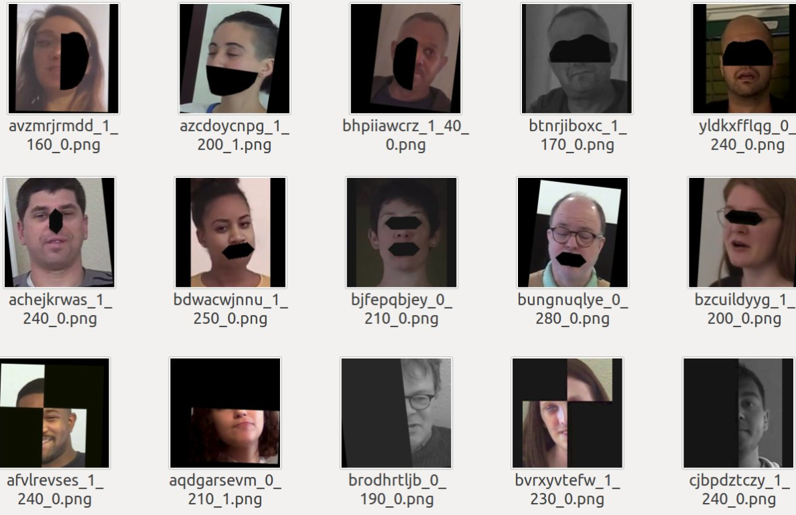
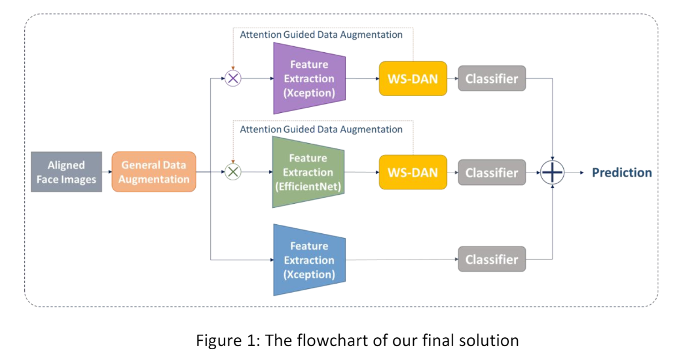
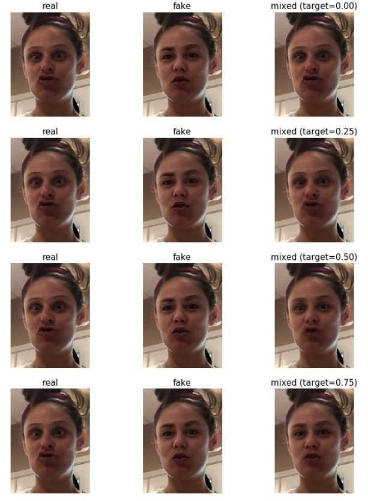
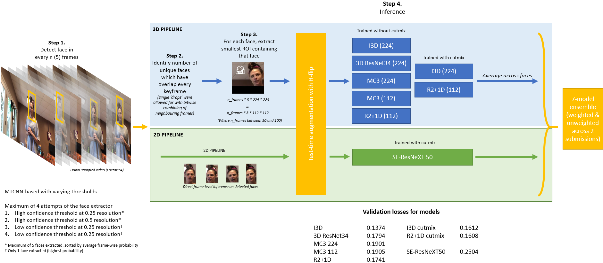

### Link

- official website: https://ai.facebook.com/datasets/dfdc/
- kaggle: https://www.kaggle.com/c/deepfake-detection-challenge/overview

- an overall of the competition and top 5 solutions: https://www.facebook.com/mediaforensics2020/videos/289928888867311/


### Competition Leaderboard

| Rank | Team                 | Score    | code                                                         |
| ---- | -------------------- | -------- | ------------------------------------------------------------ |
| 1    | Selim Seferbekov     | 0.42798  | [code](https://github.com/selimsef/dfdc_deepfake_challenge); [link](https://www.kaggle.com/c/deepfake-detection-challenge/discussion/145721) |
| 2    | \WM/                 | 0.42842  | [code](https://github.com/cuihaoleo/kaggle-dfdc)             |
| 3    | NtechLab             | 0.43452  | [code](https://github.com/NTech-Lab/deepfake-detection-challenge); [link](https://www.kaggle.com/c/deepfake-detection-challenge/discussion/158158) |
| 4    | Eighteen years old   | 0.43476  | [code](https://github.com/Siyu-C/RobustForensics)            |
| 5    | The Medics           | 0.43711  | [code](https://github.com/jphdotam/DFDC/); [link](https://www.kaggle.com/c/deepfake-detection-challenge/discussion/140364) |
| 6    | Konstantin Simonchik | 0.44289  |                                                              |
| 7    | All Faces Are Real   | 0.445315 |                                                              |
| 8    | ID R&D               | 0.44837  |                                                              |
| 9    | 名侦探柯西           | 0.44911  |                                                              |
| 10   | deeeepface           | 0.45149  |                                                              |


### Solutions collection

#### 1st Selim Seferbekov

code: https://github.com/selimsef/dfdc_deepfake_challenge

kaggle discussion: https://www.kaggle.com/c/deepfake-detection-challenge/discussion/145721

- detector: MTCNN. (no S3FD opensource license)
- augmentation: 1.  [Albumentations](https://github.com/albumentations-team/albumentations) , **2. Cutout **



- model: EfficientNet B7
- Averaging predictions:

```python
import numpy as np

def confident_strategy(pred, t=0.8):
    pred = np.array(pred)
    sz = len(pred)
    fakes = np.count_nonzero(pred > t)
    # 11 frames are detected as fakes with high probability
    if fakes > sz // 2.5 and fakes > 11:
        return np.mean(pred[pred > t])
    elif np.count_nonzero(pred < 0.2) > 0.9 * sz:
        return np.mean(pred[pred < 0.2])
    else:
        return np.mean(pred)
```

#### 2nd \WM/

code: https://github.com/cuihaoleo/kaggle-dfdc

- face extractor: [RetinaFace](biubug6/Pytorch_Retinaface)
- **model**: **[WS-GAN](https://github.com/GuYuc/WS-DAN.PyTorch)** with Xception and WS-GAN efficient-net
- flow



#### 3rd NTechLab

code: https://github.com/NTech-Lab/deepfake-detection-challenge

kaggle discussion: https://www.kaggle.com/c/deepfake-detection-challenge/discussion/158158

- face extractor: [WIDERFace_DSFD](https://github.com/Tencent/FaceDetection-DSFD/tree/31aa8bdeaf01a0c408adaf2709754a16b17aec79)

- model: three EfficientNet-B7, 2 of which are frame-by-frame while the other is squence-based.

- augmentation:  

  - 1. AutoAugment, Random Erasing, Random Crops, Random Flips, and various video compression parameters.

  - 2. **Mixup** on aligned real-fake pairs
  - ```input_tensor = (1.0 - target) * real_input_tensor + target * fake_input_tensor```
  - 

- external data: 

| File Name                            | Source                                                       | Direct Link                                                  | Forum Post                                                   |
| ------------------------------------ | ------------------------------------------------------------ | ------------------------------------------------------------ | ------------------------------------------------------------ |
| WIDERFace_DSFD_RES152.pth            | [github](https://github.com/Tencent/FaceDetection-DSFD/tree/31aa8bdeaf01a0c408adaf2709754a16b17aec79) | [google drive](https://drive.google.com/file/d/1WeXlNYsM6dMP3xQQELI-4gxhwKUQxc3-/view) | [link](https://www.kaggle.com/c/deepfake-detection-challenge/discussion/121203#761391) |
| noisy_student_efficientnet-b7.tar.gz | [github](https://github.com/tensorflow/tpu/tree/4719695c9128622fb26dedb19ea19bd9d1ee3177/models/official/efficientnet) | [link](https://storage.googleapis.com/cloud-tpu-checkpoints/efficientnet/noisystudent/noisy_student_efficientnet-b7.tar.gz) | [link](https://www.kaggle.com/c/deepfake-detection-challenge/discussion/121203#748358) |

#### 4th RobustForensics by *Eighteen Years Old*

code: https://github.com/Siyu-C/RobustForensics

- face extractor: [`RetinaFace`](https://github.com/biubug6/Pytorch_Retinaface.git)
- model:  7 image-based models and 4 **video-based models**. 
  - image based: resnet34, xception, efficientnet
  - video based: slowfast

#### 5th The Medics

code: https://github.com/jphdotam/DFDC/

- face extractor: MTCNN
- model:
  - 3D CNN: 
    - arch: 7 different 3D CNNs across 4 different architectures (I3D, 3D ResNet34, MC3 & R2+1D) and 2 different resolutions (224 x 224 & 112 x 112).
    - aug: 3D **[cutmix](https://arxiv.org/abs/1905.04899v2)** approach
  - One 2D CNN
    - arch: SE-ResNeXT50
    - aug: mpeg compress.

- pipeline:




---


#### 2nd Place Removed Solution - All Faces Are Real Team

Kaggle discussion: https://www.kaggle.com/c/deepfake-detection-challenge/discussion/157983

- face extractor: CenterNet 
- The travel of a single model

| model                                                        | score   |
| ------------------------------------------------------------ | ------- |
| IR-SE-50                                                     | 0.51639 |
| + deeper arch (IR-SE-152)                                    | 0.436   |
| + remove noisy cases with mask filtering                     | 0.40    |
| + BoundingBox X 1.3 -> resize to 291x291-> random cropping to 224x224. | 0.376   |
| + change to RA-92                                            | 0.362   |
| + select part 0-9 as valid                                   | 0.342   |
| + face tracking / More faces per video                       | 0.331   |
| + additional training data from part 5~9 and FF++ / Random erasing | 0.323   |
| + sphere and water augmentation from DALI                    | 0.313   |

- using model ensembling


#### TODO

- [ ] https://www.kaggle.com/c/deepfake-detection-challenge/discussion/145740